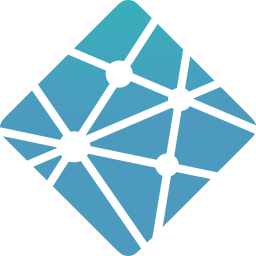

# Hi there, I'm Rami Sami - [Rami-init][linkedin] 👋 

## I'm a Developer, and Search for a job early!!

- 🌱 I’m currently trying to learn more about react.js next.js🤣
- 👯 I’m looking to collaborate with other content creators
- 🥅 2022 Goals: Learn more about web3
- ⚡ Fun fact: I love to draw, play playstation and fan Liverpool 😎
- 😻 Check out my latest project i built 👉
### Connect with me:

  

  

  

### Languages and Tools:

 
 

---

  
:zap: Recent GitHub Activity

  
<!--START_SECTION:activity-->

<!--END_SECTION:activity-->

  
:zap: GitHub Stats

  

[website]: https://ramy.cf
[twitter]: https://twitter.com/Ramy_Samy_I
[youtube]: https://www.youtube.com/channel/UCKvmQiU8GRJB47H35jK89aA
[instagram]: https://www.instagram.com/rami_sami_i/
[linkedin]: https://www.linkedin.com/in/rami-sami-94b57077/
[facebook]: https://www.facebook.com/profile.php?id=100005091041495

